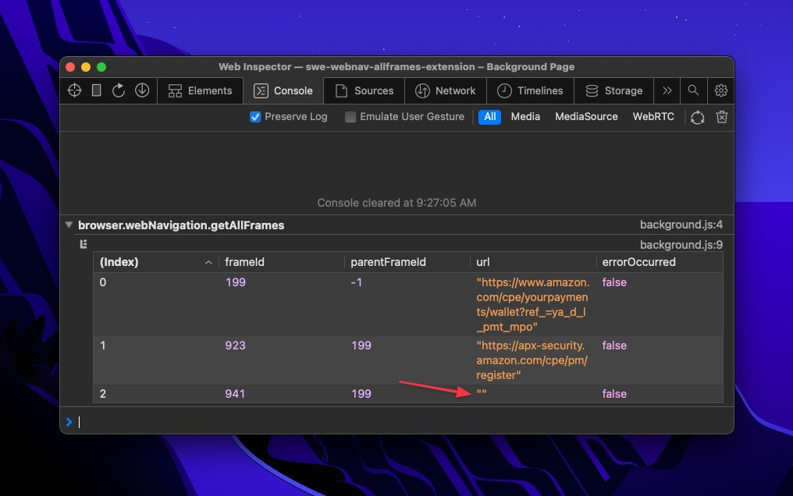
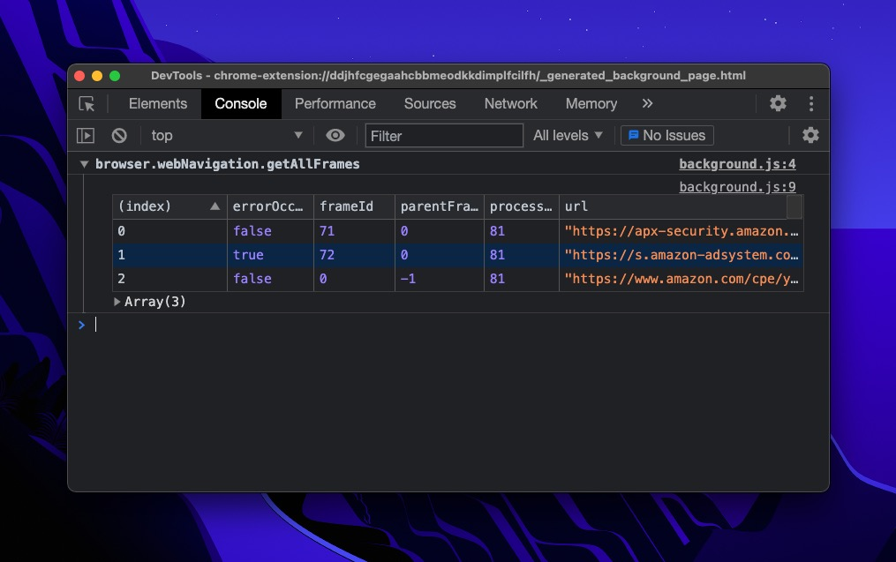
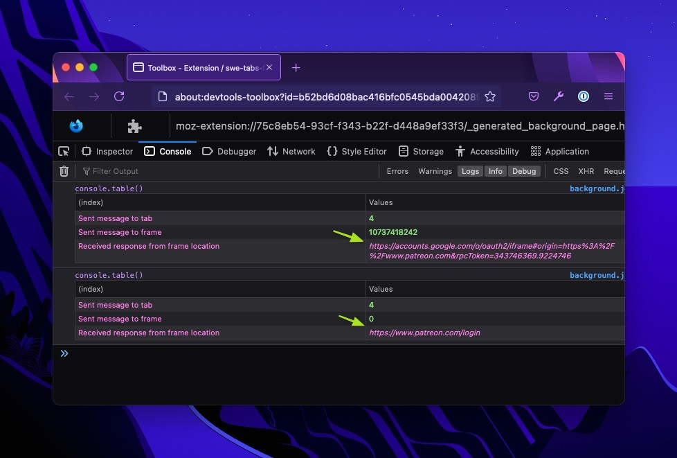

# browser.webNavigation.getAllFrames()

The purpose of this project is to highlight the difference between [`browser.webNavigation.getAllFrames()`](https://developer.mozilla.org/en-US/docs/Mozilla/Add-ons/WebExtensions/API/webNavigation/getAllFrames) in Safari and other web browsers. When a navigation error occurs in a frame, Safari will return an empty string as the frame's URL. This must be filtered out before parsing the URLs in JavaScript.

This project is based on the example [Safari Web Extension Xcode project](https://developer.apple.com/documentation/safariservices/safari_web_extensions/creating_a_safari_web_extension). It also uses [WebExtension `browser` API Polyfill](https://github.com/mozilla/webextension-polyfill) to work in Chrome.

## Example

This example shows loading this extension in each browser, clicking the browser action to run `browser.webNavigation.getAllFrames()` from the background, and logging the response of each to the background console.

### Safari

Safari appears to only ever return a `false` `errorOccurred` property, and returns an empty string for URL if the last navigation in a frame was interrupted by an error.

   

### Chrome

   

### Firefox

Firefox does not return an `errorOccurred` property.

   

